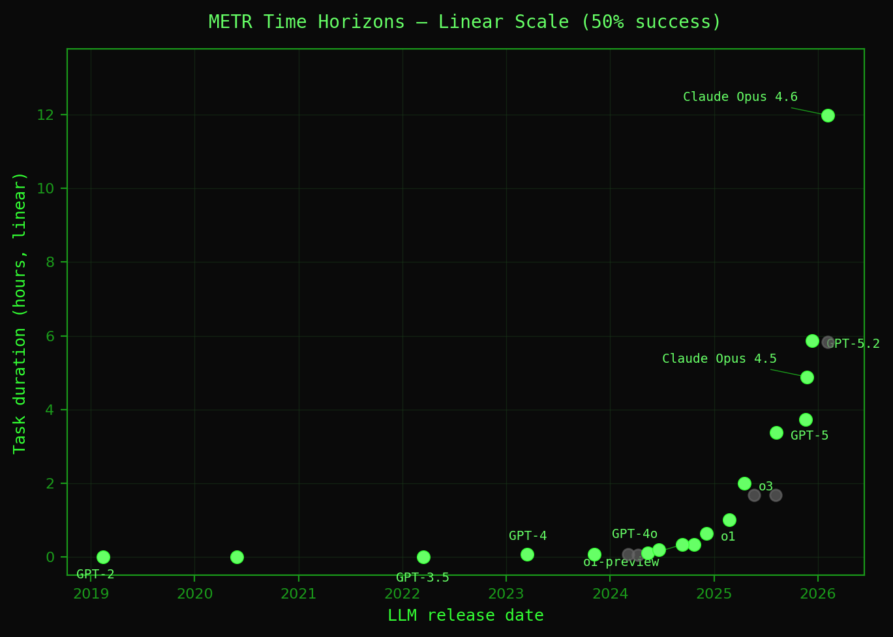

# State of Vibe Coding 2026

> 의도만 남고, 나머지는 추상화된다

---

## 발표자 소개

정도현
- ROBOCO 수석 컨설턴트
- 30년차 소프트웨어 엔지니어
- 2016~2024 아마존에서 소프트웨어 엔지니어, 테크니컬 트레이너로 근무
- 2024년 말 바이브 코딩의 가능성을 확인하고 2026년 ROBOCO 창업
- 현재 기업의 AI 트랜스포메이션을 컨설팅하고 있다

---

## 오늘 이야기할 것

- 2026년 4월, 바이브 코딩의 현재
- AI 능력의 성장과 그 의미
- **규칙과 취향**을 어디서 나눌 것인가
- 사양, 구현, 하네스가 어떻게 추상화되는가
- **Intent Engineering** — 왜 결국 의도만 남는가
- 그 흐름이 이미 현실인 사례 — OpenClaw, oh-my-claudecode
- 그래서 지금 무엇부터 시작할 것인가

---

<!-- _class: divider -->

# 2026년 4월, 바이브 코딩의 현재

---

## 바이브 코딩은 AI 전환의 일부다

바이브 코딩만 따로 보면 전체 흐름을 놓친다.

- 코드 생성은 AI 트랜스포메이션의 **한 조각**일 뿐
- 사양, 테스트, 배포, 모니터링, 학습까지 함께 바뀌고 있다
- <span class="accent">소프트웨어 개발 전 과정이 AI와 함께 재편되고 있다</span>

---

<!-- _class: divider -->

# AI의 능력은 기하급수적으로
# 증가하고 있다

---

## METR: AI 작업 수행 시간의 지평선

<div style="display: flex; gap: 32px; align-items: center;">
<div style="flex: 1; min-width: 0;">

- 작업 범위가 **7개월마다 2배**로 늘어난다
- 이 추세가 이어지면 2029년 안에 인간이 **1달 걸리는 작업**도 AI가 수행
- 함께 커지는 세 가지:
  - **지능** — 더 복잡한 추론과 판단
  - **기억력** — 더 큰 컨텍스트 윈도우
  - **도구 사용** — 브라우저, 터미널, API

<span class="dim" style="font-size: 16px;">출처: metr.org/time-horizons</span>

</div>
<div style="flex: 1; min-width: 0;">



</div>
</div>

---

## 이 성장이 의미하는 것

우리는 기하급수적인 상승 사이클에 이미 진입해 있음

- 구현 가능 범위는 함수 단위를 넘어 시스템 단위가 되었음
- 사양 작성은?
- 가드레일은?

> 그렇다면 사람과 AI의 경계선은?

---

<!-- _class: divider -->

# 규칙과 취향을 구별하라

---

## 규칙: 조직 전체에 강제 되는 필수 사항

- 빌드/테스트 게이트 — 빠지면 버그를 놓친다
- Git 안전 규칙 — 멀티 에이전트에서 작업 충돌을 막는다
- 보안 경계 — 시크릿 커밋, 실제 데이터 사용 금지
- 아키텍처 경계 — import, package, 공개 API 제한
- 고위험 변경 — 인증, 결제, DB 스키마는 수동 리뷰 필수

> <span class="accent">규칙은 자동화로 강제해야 한다.</span>
> AGENTS.md, CI/CD, pre-commit hook, CODEOWNERS

---

## 취향: 다르게 해도 괜찮은 것

- 세미콜론, 공백, trailing comma
- 이름 짓기와 import 정렬
- 주석 스타일
- 추상화 타이밍
- feature-based vs layer-based 구조

---

<!-- _class: divider -->

# 결국 의도만 남는다

---

## 사양, 구현, 하네스 — 취향인가?

| 영역 | 성격 | AI 시대의 위치 |
|------|------|---------------|
| **사양(Spec)** | What에서 도출 가능 | AI가 생성 |
| **구현(How)** | 기술 선택 + 코딩 | AI의 영역 |
| **하네스(가드레일)** | 규칙의 자동화 | 규칙 + 스킬 |
| **테스트** | 검증의 자동화 | AI가 생성 + CI가 강제 |
| **배포** | 파이프라인 | CD가 자동 실행 |

> 취향의 여지는 일부뿐이다.
> <span class="accent">그래서 끝까지 사람이 쥐고 있어야 할 것은 How보다 의도다.</span>

---

<!-- _class: impact -->

## 끝까지 사람이 쥐고 있어야 할 것은?

---

## 바이브 코딩과 XY 문제

XY 문제: 문제(X) 대신 먼저 떠올린 해법(Y)을 고정하는 것

- "테스트가 실패하는데 고쳐줘" → AI가 **테스트를 삭제**
- "빌드 에러 해결해줘" → AI가 **타입 체크를 비활성화**
- "성능을 개선해줘" → AI가 **캐시를 잔뜩 추가** (진짜 병목은 DB)

> AI는 의도를 추론하지만, <span class="warn">의도가 명확하지 못하면 잘못된 해법을 사용한다.</span>

---

## 핵심은 의도의 명확한 전달이다

> 로보코의 바이브 코딩 핵심 전략:
> 최소한의 노력으로 **의도**를 명확하게 전달하는 것

코드 생성, 검증, 배포 비용이 함께 내려갈수록
남는 희소자원은 **"무엇을, 왜 만들 것인가"** — 즉, <span class="accent">의도</span>다.

---

## 그래서 Intent Engineering이다

> **Ship intent, not code.**

```markdown
# INTENT — [Project Name]

> status: seed | exploring | clarified | killed

## Why    ← 이것이 왜 존재해야 하는가
## What   ← 무엇을 만드는가 (How는 적지 않는다)
## Not    ← 절대 하지 않을 것, 경계선
## Learnings ← 탐구하며 배운 것들
```

- **How는 적지 않는다.** AI가 채운다.
- **Not이 없으면** AI는 비어 있는 가정을 대신 채운다.

---

## 의도의 생명주기

```
seed → exploring → clarified → build
  │        │            │
  └────────┴────────────┴──→ killed
```

| 상태 | 설명 |
|------|------|
| **seed** | 아이디어만 있다. 가설을 적고 첫 실험 |
| **exploring** | 프로토타입, 인터뷰, 리서치로 검증 중 |
| **clarified** | Why/What/Not이 확신으로 채워졌다. AI에게 넘긴다 |
| **build** | 구현과 검증을 자동화 파이프라인으로 실행한다 |
| **killed** | 증거가 "만들지 말라"고 한다. 이것도 좋은 결과다 |

---

## 파이프라인에서 사람이 개입이 필요한 부분은?

```
  [Intent 전달]     ← 의도를 명확화
         ↓
  [Spec 생성]           ← Why/What/Not에서 태스크 도출
         ↓
  [구현]                ← 코드 작성
         ↓
  [검증]                ← 리뷰, 테스트, 린트
         ↓
  [배포]                ← CI/CD에 의한 릴리스
         ↓
  [피드백]              ← 사용자 데이터 분석
         ↓
  [학습 & 판단]         ← 평가하고, 의도를 갱신하거나 종료
```

---

<!-- _class: divider -->

###  코드를 보지않는 개발이 가능한가?

# 이미 현실이다

---

## OpenClaw: 한 사람 + AI = 20명 팀의 속도

GitHub **31만+ 스타**. 바이브 코딩이 어디까지 왔는지 보여주는 사례.

- **3~8개 AI 에이전트**를 병렬 실행
- 한 달 **6,600개 커밋**
- 입력은 **1~2문장 + 스크린샷**
- 인간은 코드를 다 읽기보다 **구조와 설계**를 붙잡는다
- 이를 받쳐주는 것이 **AGENTS.md와 게이트**다

> 인간은 아키텍처, 취향, 조율을 맡는다.
> 구현, 보일러플레이트, 리팩터링은 에이전트에게.

---

## oh-my-claudecode: 의도 기반 멀티 에이전트 오케스트레이션

의도만 주면 전문 에이전트가 순서대로 수행한다:

```
의도 전달
  → explore (코드베이스 탐색)
    → plan (구현 계획 수립)
      → implement (코드 작성)
        → verify (검증)
          → commit (커밋)
```

- 탐색부터 커밋까지 자동 파이프라인
- 역할이 분리된 전문 에이전트가 각 단계를 맡는다
- <span class="accent">이미 프로덕션 워크플로로 동작 중</span>

---

## 이미 의도 중심으로 동작하는 프로세스가 존재한다

앞선 사례가 공통으로 보여주는 구조:

1. 사람은 **의도 작성**과 **최종 판단**을 맡는다
2. 그 사이의 상당 부분은 자동화가 맡는다

- Spec 도출 → 구현 → 테스트 → 리뷰 → 배포

> <span class="accent">AI 트랜스포메이션은 이미 현재 진행형이다.</span>

---

## AI 트랜스포메이션의 가속

- **2025**: 바이브 코딩이 "되냐 안 되냐"를 두고 논쟁
- **2026**: "어떻게 잘 하느냐" — 규칙, 하네스, 의도가 차별화 요소
- **2027~**: 이 추세가 이어지면, 의도만 남고 나머지는 추상화된다
  - 인간은 의도 정의자, 검증자, 의사결정자

> METR: AI 능력은 7개월마다 2배.
> 이 가속은 멈추지 않는다.

---

<!-- _class: divider -->

# 그래서 어떻게 시작할 것인가

---

## 작은 것부터, 덜 중요한 것부터

- <span class="warn">처음부터 핵심 시스템에 적용하지 마라</span>
- 사이드 프로젝트, 내부 도구, 프로토타입부터 시작
- 점진적으로 확대:

```
사이드 프로젝트
  → 내부 도구
    → 신규 서비스
      → 기존 시스템 개선
```

> 실패 비용이 낮은 곳에서 먼저 배우고, 그다음 확대하라.

---

## 의도의 품질도 아는 만큼 나온다

AI가 대신 만들어도, 의도의 품질은 사람의 이해에 달려 있다.

- **Why**를 쓰려면 → <span class="accent">도메인 이해</span>
- **What**을 쓰려면 → <span class="accent">기술 이해</span>
- **Not**을 쓰려면 → <span class="accent">경험</span>

> AI가 선택지를 늘려도, <span class="accent">선택은 우리가 한다.</span>

---

## 오늘 바로 할 수 있는 4가지

1. 다음 프로젝트에 **INTENT.md**를 먼저 쓴다. Why, What, Not만 적고 How는 적지 않는다
2. **AGENTS.md / CLAUDE.md**를 만든다. 빌드 명령, 금지 목록, 커밋 규칙부터 적는다
3. **규칙과 취향을 구별**해 기록한다. 사고 나는 것만 규칙으로 닫는다
4. **작은 프로젝트 하나**에 AI와 함께 전체 사이클을 돌려본다

---

<!-- _class: impact -->

### 의도를 명확하게
### 나머지는 AI가

# https://intent.roboco.io

---

<!-- _class: divider -->

# 경청해 주셔서 감사합니다.
